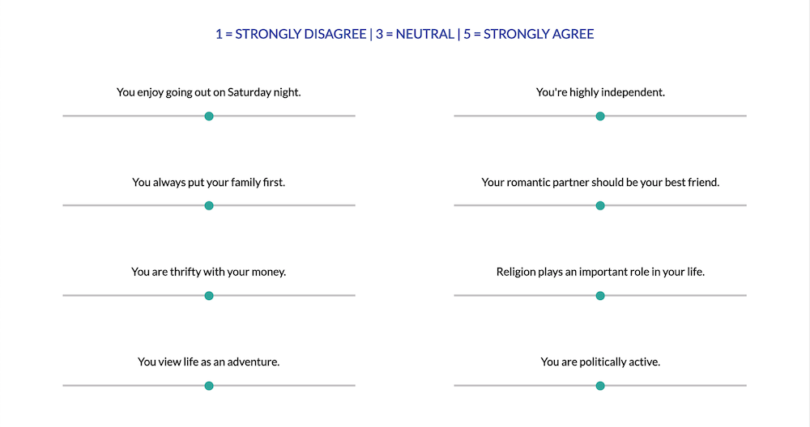

# Friend Finder

This is a simple dating application. You must enter your name, age, a link to a profile picture, your gender, and the gender you are interested in dating. Then you'll fill out a short survey of 16 statements. For each statement you should rate on a scale of 1 to 5 how much you agree or disagree.

When you submit your info, it will get stored in the database. Then your survey answers will be compared to those of all other people in the database who match the gender you are looking to date (and if you match the gender they are looking for of course!), and find you the person from that pool whose survey answers were most closely aligned with yours.

This app uses Node, Express, Sequelize, mySQL, HTML, lots of CSS, and a touch of Materialize.

#### Check out the app yourself here!! 
###### Please be sure to include a link to a profile picture for yourself.
(You can use something from Pexels.com if you don't want to include a real picture of yourself. Just search for a picture of a man or woman, etc...)

[Friend Finder](https://friend-finder-fun-2018.herokuapp.com/)

## Screenshots

## Contributing & Support

Contributions are closed at this time. Please reach out with any questions.

## Authors

Gray Atkinson-Adams

## License

[MIT](https://choosealicense.com/licenses/mit/)
